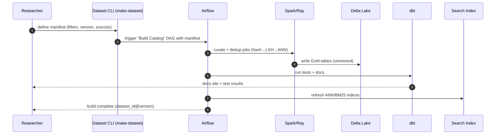

# Data Infrastructure Proposal — Diagrams

This document contains system design diagrams in Mermaid format.

## High-Level Architecture
```mermaid
flowchart LR
    subgraph Sources[External Sources]
      W[Web / Crawler]:::src
      P[Partners / OSS Corpora]:::src
    end

    W -->|HTML/Media| K[(Kafka<br/>raw_html, media, metrics)]:::mq
    P --> K

    subgraph Proc[Processing]
      SS[Spark Structured Streaming<br/>(parse, normalize, extract)]:::compute
      RY[Ray Workers<br/>(embeddings/OCR/ASR)]:::compute
    end

    K --> SS
    SS -->|raw→landing| BR[(Delta: Bronze)]:::delta
    BR -->|curate + PII scrub| SL[(Delta: Silver)]:::delta
    SL -->|tiered dedup| DD[Dedup Pipeline<br/>(SHA256 → MinHash/SimHash → ANN)]:::service
    DD --> GD[(Delta: Gold<br/>Train Catalogs + Manifests)]:::delta

    subgraph Catalog[Discovery & Repro]
      DBT[dbt models + tests + docs]:::tool
      IDX[Search Index<br/>(BM25 + ANN)]:::tool
      MF[Dataset Manifests<br/>(semver + content address)]:::tool
    end

    GD --> DBT
    GD --> IDX
    GD --> MF

    subgraph Consumers[Researchers & Training]
      TR[Training Jobs]:::user
      EV[Evals / Slice Discovery]:::user
      VZ[Analytics / Viz]:::user
    end

    MF --> TR
    IDX --> EV
    GD --> TR
    GD --> EV
    DBT --> VZ

    classDef src fill:#e9f5ff,stroke:#5aa9e6,stroke-width:1.2;
    classDef mq fill:#fff2cc,stroke:#e6b800,stroke-width:1.2;
    classDef compute fill:#f5e9ff,stroke:#a05ae6,stroke-width:1.2;
    classDef delta fill:#e6ffe9,stroke:#34a853,stroke-width:1.2;
    classDef tool fill:#ffe9f2,stroke:#e65a9b,stroke-width:1.2;
    classDef service fill:#f0f0f0,stroke:#888,stroke-width:1.2;
    classDef user fill:#e8f7f0,stroke:#2aa198,stroke-width:1.2;
```

## Deduplication Pipeline
```mermaid
flowchart TB
    IN[(Silver Inputs)]:::delta --> C1[Canonicalize Text/Bytes<br/>normalize encodings, strip HTML, collapse whitespace]:::step
    C1 --> H1[Exact Dedup<br/>SHA-256]:::gate
    H1 -->|unique| CAND1
    H1 -->|dupe| OUTX1[(Drop / Link to Canonical)]:::out

    CAND1[Candidates]:::hold --> T2[Text Near-Dedup]:::step
    T2 -->|Shingles→MinHash| LSH[LSH Buckets]:::gate
    LSH --> SIM[SimHash + Hamming<br/>& Levenshtein/Jaccard confirm]:::gate
    SIM -->|keep| CAND2
    SIM -->|dupe| OUTX2[(Drop / Link to Canonical)]:::out

    CAND2[Candidates]:::hold --> M2[Media Near-Dedup]:::step
    M2 --> PH[Perceptual Hash (images/video keyframes)]:::gate
    M2 --> EMB[Embeddings (CLIP/MFCC) → ANN (HNSW/FAISS)]:::gate
    PH --> VERIFY[Verify (SSIM / cosine threshold)]:::gate
    EMB --> VERIFY
    VERIFY -->|keep| OUTK[(Keep → Gold)]:::out
    VERIFY -->|dupe| OUTX3[(Drop / Link to Canonical)]:::out

    classDef delta fill:#e6ffe9,stroke:#34a853,stroke-width:1.2;
    classDef step fill:#eef3ff,stroke:#5a76e6,stroke-width:1.2;
    classDef gate fill:#fff2cc,stroke:#e6b800,stroke-width:1.2;
    classDef out fill:#f9e2e2,stroke:#d33,stroke-width:1.2;
    classDef hold fill:#f0f0f0,stroke:#888,stroke-width:1.2;
```

## Orchestration & Reproducibility
```mermaid
flowchart LR
    TRF[Terraform IaC]:::iac --> AF[Airflow]:::sched
    TRF --> CL[Spark/Ray Clusters]:::compute
    TRF --> STG[Storage / Delta]:::delta
    AF --> DAG1[Crawl→Kafka→Bronze DAG]:::dag
    AF --> DAG2[Curate→Silver DAG]:::dag
    AF --> DAG3[Dedup DAG]:::dag
    AF --> DAG4[Build Catalog (Gold) DAG]:::dag
    DAG4 --> MF[Manifest (semver, content-addressed)]:::doc
    DAG4 --> DBT[dbt run+test+docs]:::doc
    DBT --> DOCS[Docs Site]:::doc
    AF --> MON[Monitoring/Alerts<br/>SLIs/SLOs, Cost, Lag]:::mon
    MON --> RUN[Runbooks / On-call]:::doc

    classDef iac fill:#e8f7f0,stroke:#2aa198,stroke-width:1.2;
    classDef sched fill:#f5e9ff,stroke:#a05ae6,stroke-width:1.2;
    classDef compute fill:#eef3ff,stroke:#5a76e6,stroke-width:1.2;
    classDef delta fill:#e6ffe9,stroke:#34a853,stroke-width:1.2;
    classDef dag fill:#fff2cc,stroke:#e6b800,stroke-width:1.2;
    classDef doc fill:#ffe9f2,stroke:#e65a9b,stroke-width:1.2;
    classDef mon fill:#f9f7e6,stroke:#b59f3b,stroke-width:1.2;
```

## Dataset Build Sequence (Researcher POV)

